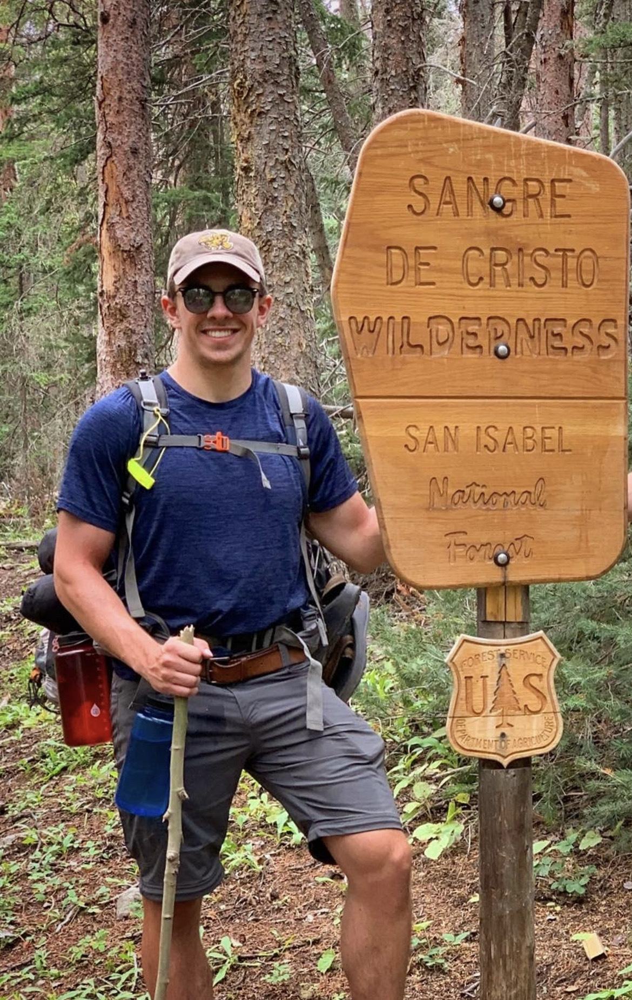
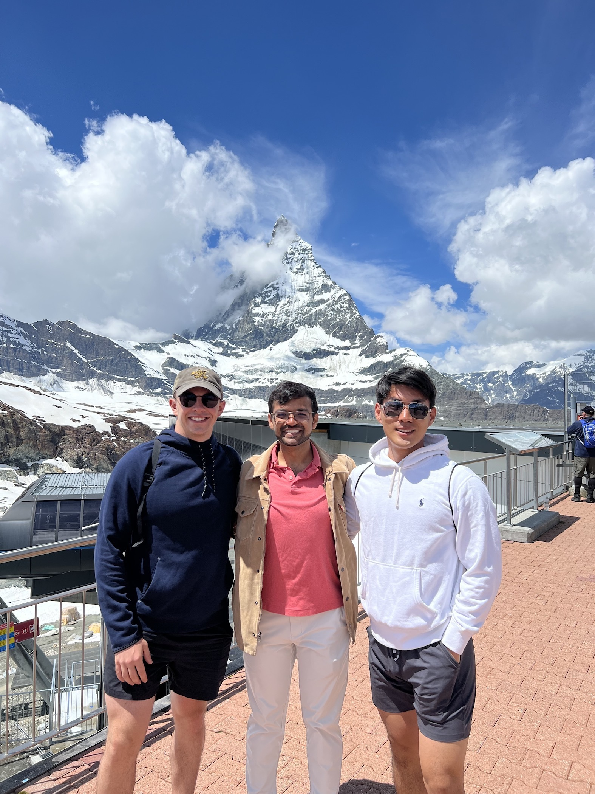
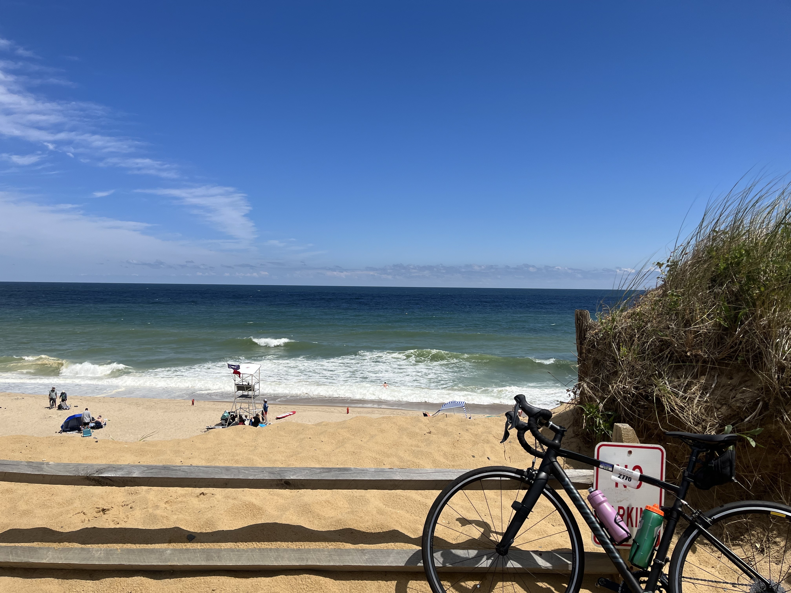
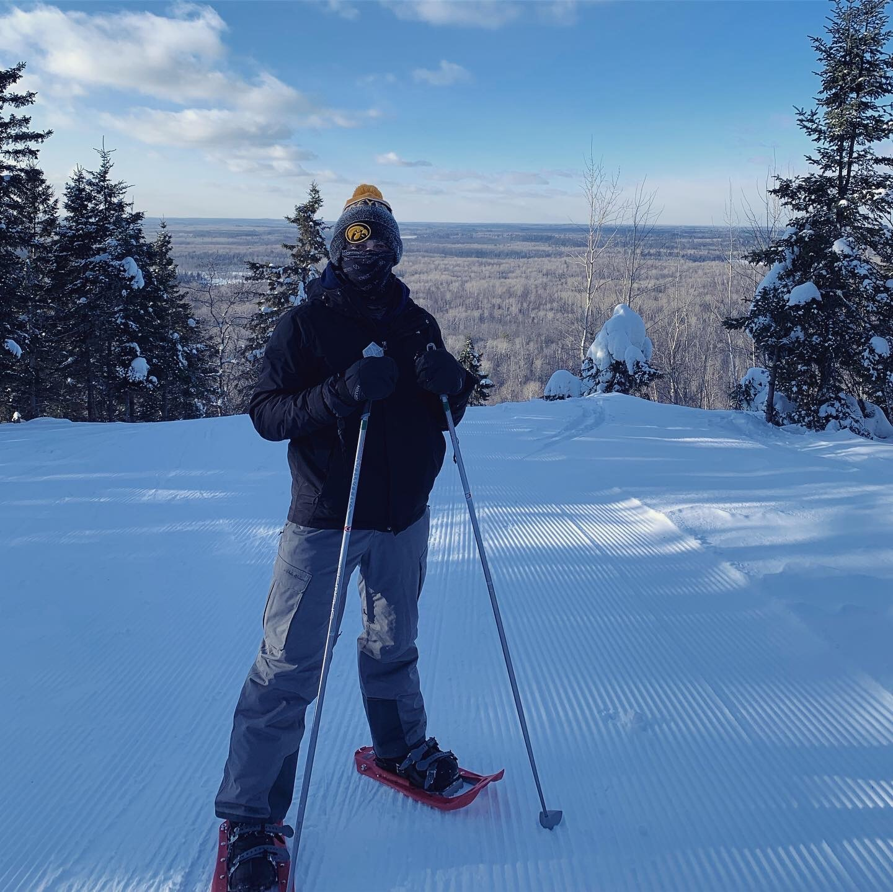
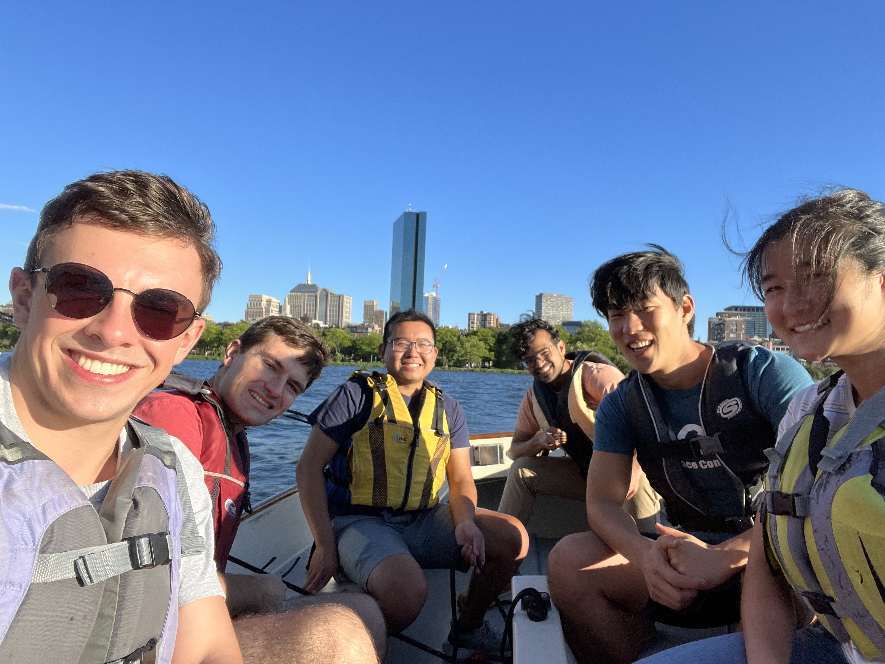

When I'm not working or studying for classes, I like to spend time outdoors biking, hiking, and camping.
I also enjoy weightlifting, playing ultimate frisbee, and watching Iowa football.

<!-- 
*Backpacking in Colorado*

 -->

<!--  -->

<!-- 

  <figure>
    
    <figcaption>Backpacking Trip - Sangre De Cristo Wilderness, CO</figcaption>
  </figure>
  

  <figure>
    
    <figcaption>Backpacking Trip - Sangre De Cristo Wilderness, CO</figcaption>
  </figure>

  <figure>
    
    <figcaption>Backpacking Trip - Sangre De Cristo Wilderness, CO</figcaption>
  </figure>

  <figure>
    
    <figcaption>Backpacking Trip - Sangre De Cristo Wilderness, CO</figcaption>
  </figure>

  <figure>
    
    <figcaption>Backpacking Trip - Sangre De Cristo Wilderness, CO</figcaption>
  </figure>

 -->

<!-- 

  <figure>
    
    <figcaption>Backpacking Trip - San Isabel National Forest, CO</figcaption>
  </figure>

  <!-- Add the rest of your figure elements here -->

<!-- <head>
  <title>Image Gallery</title>
  
</head>
<body> -->

  
  
Bike Ride to Provincetown - Cape Cod, MA

  
  
Traveling Europe - Zermatt, Switzerland

  
  
Backpacking Trip - Four Pass Loop, CO

  
  
Backpacking Trip - San Isabel National Forest, CO

  
  
Snowshoeing Trip - Duluth, MN

  
  
Sailing - Cambridge, MA

